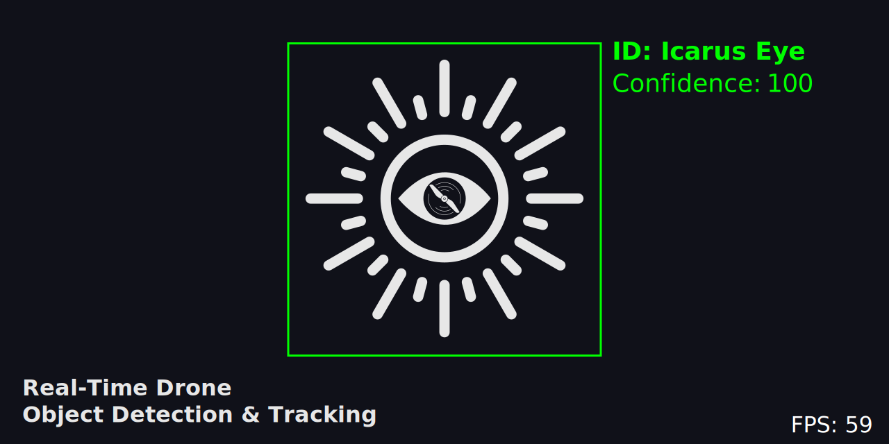

<details>
  <summary><strong>ARCHIVED PROJECT (SEE DETAILS)</strong></summary>
  
  This repository is read-only and will not be updated.
  
  Both this project and ZephyrNet are being migrated into a single projected called [IcarusEye-V2](https://github.com/JonathanLTurner03/IcarusEye/) in which the architecture is being completely rebuild to optimize for edge-device computing, maintainability, modularity and usability.
</details>

# <h1 align="center">IcarusEye</h1>



---
## Description
Icarus Eye is built using a custom YOLOv8s model trained on the VisDrone2019-DET Dataset. This project is a semester 
project for a Machine Vision course at KSU. The project aims to be a proof of concept for real-time object detection and
tracking using a drone. The project is built using Python, OpenCV, and PyTorch. The project is built to be modular and
customizable, allowing for easy integration with other models and datasets. The project's name is a pun and a reference 
to the Greek myth of Icarus, who flew too close to the sun and fell, and the vigilant Eye of Sauron from the Lord of the 
Rings.

## Table of Contents

- [Description](#description)
- [Introduction](#introduction)
- [Features](#features)
- [Installation](#installation)
- [Demonstration / Examples](#demonstration--examples)
- [Usage](#usage)
- [Limitations](#limitations)
- [Future Work](#future-work)
- [License](#license)

# Introduction

The project is built using a custom YOLOv8s model trained on the VisDrone2019-DET Dataset. The project is built with
Python utilizing the following libraries:

| :books: Library | :spiral_notepad: Description         | Version   | :globe_with_meridians: Website                                     | :pie: PyPi Repo                                          |
|-----------------|--------------------------------------|-----------|--------------------------------------------------------------------|----------------------------------------------------------|
| Ultralytics     | Open Source Object Detection Library | 8.3.1     | [Ultralytics.com](https://www.ultralytics.com/)                    | [ultralytics](https://pypi.org/project/ultralytics/)     |
| OpenCV          | Open Source Computer Vision Library  | 4.10.0.84 | [OpenCV.org](https://opencv.org/)                                  | [opencv-python](https://pypi.org/project/opencv-python/) |
| PyTorch         | Open Source Machine Learning Library | 2.4.1     | [PyTorch.org](https://pytorch.org/)                                | [torch](https://pypi.org/project/torch/)                 |
| PyQt6           | Python Binding for Qt                | 6.7.1     | [RiverbankComp](https://www.riverbankcomputing.com/software/pyqt/) | [PyQt6](https://pypi.org/project/PyQt6/)                 |
| Numpy           | Scientific Computing Library         | 1.26.4    | [NumPy.org](https://numpy.org/)                                    | [numpy](https://pypi.org/project/numpy/)                 |
| MatPlotLib      | Data Visualization Library           | 3.5.1     | [MatPlotLib](https://matplotlib.org/)                              | [matplotlib](https://pypi.org/project/matplotlib/)       |

The core of the project is built using the Ultralytics YOLOv8s model along with Ultralytics ByteTrack implementation.

## Features
The project was built with the edge device in mind, and as such, the project is optimized for performance / tuning.
The project has the following features:
- Easy swapping of Ultralytics YOLO models.
- Quick and easy modification of output tuning.
- Performance optimizations
    - Max-Bounding Box (Sorted by Confidence)
    - Nth Frame Detection / Tracking
    - Framerate control on pre-recorded video
- Live list of omitted classes
- Toggleable tracking
- *and more...*

## Installation

Regardless of the installation method, the project heavily benefits from `ffmpeg` being installed on the system. This
allows for the video device detection, settings, and controls to be more accessably and user-friendly. 

### Windows Installation
The following
link will guide you through the installation process for `ffmpeg` on your system: 
[FFmpeg Installation](https://www.wikihow.com/Install-FFmpeg-on-Windows)

### Linux Installation (Debian/Ubuntu)
The following command will install `ffmpeg` on your system:
```bash
sudo apt-get install ffmpeg
```

### MacOS Installation
The following command will install `ffmpeg` on your system utilizing `brew`:
```bash
brew install ffmpeg
```

### Installation Method 1: Cloning and Directly running from Source
When installing the project, it is *recommended* to use a virtual environment. Along with this, since the project 
utilizes `torch` and `torchvision`, it is recommended to install the libraries with `CUDA` support. Without this, the
project will run on the CPU, which will be significantly slower. The following steps will guide you through the
installation process.

* ***(Optional) Create a virtual environment:***
```bash
python -m venv venv
source venv/bin/activate  # Linux / MacOS
venv\Scripts\activate     # Windows
```

1. **Clone the repository:**
```bash
git clone https://github.com/JonathanLTurner03/IcarusEye.git
cd IcarusEye
```

*Prior to this next step, if you have a CUDA compatible GPU, you can modify the requirements.txt file to include the
appropriate version of `torch` and `torchvision`. If you do not have a CUDA compatible GPU, you can skip this step.*

2. **Install the required libraries:**
```bash
pip install -r requirements.txt 
```

3. **Run the project:**
```bash
python3 main.py
```

### Installation Method 2: Using the PyInstaller Executable
***In Progress***

## Demonstration / Examples
***In Progress***

## Usage
The project is built to be user-friendly and easy to use. The project is built with a GUI using PyQt6. The following 
steps will guide you through the usage of the project. 

**Changing the Model**
- Click the `Model` dropdown menu.
- Select change YOLO model.
- Select the model you wish to use.
- If the model is not in the dropdown or you wish to use a custom model:
  - click the `Custom` option and select the model's `.pt` file.
  - Click `OK`.
- Click `Submit` to apply the changes.

**Loading a pre-recorded video**
- Click the `File Input` radio button.
- Click the `Select Video File` button.
- Find and select the video file you wish to use utilizing the popup `explorer` file selector.
- After selecting the video file, click `Play` to start the video playback.

**Using a webcam / capture device**
  - Click the `Device Input` radio button (*if not already selected as default*).
  - Click the `Select Device` dropdown menu and select the capture device wanted.
  - If wanting to use the device's self-reported settings, select the `Automatic` radio button and then `Submit`. **NOT RECOMMENDED**
  - If wanting to use custom settings, select the `Manual` radio button.
      - Select the `FPS` number field and specify the desired FPS.
      - If needed, change the codec to a **fourcc** codec.
      - Select the `Resolution` Textbox and specify the desired resolution *Note: it must be in the format of `widthxheight`.
      - Click `OK`.
  - After selecting the device and settings, click `Play` to start the video feed.

*Still In Progress*

## Limitations
***In Progress***

## Future Work
***In Progress***

## License
Licensed under the MIT License. See [LICENSE](LICENSE) for more information.

```
MIT License

Copyright (c) 2024 Jonathan Turner

Permission is hereby granted, free of charge, to any person obtaining a copy
of this software and associated documentation files (the "Software"), to deal
in the Software without restriction, including without limitation the rights
to use, copy, modify, merge, publish, distribute, sublicense, and/or sell
copies of the Software, and to permit persons to whom the Software is
furnished to do so, subject to the following conditions:

The above copyright notice and this permission notice shall be included in all
copies or substantial portions of the Software.

THE SOFTWARE IS PROVIDED "AS IS", WITHOUT WARRANTY OF ANY KIND, EXPRESS OR
IMPLIED, INCLUDING BUT NOT LIMITED TO THE WARRANTIES OF MERCHANTABILITY,
FITNESS FOR A PARTICULAR PURPOSE AND NONINFRINGEMENT. IN NO EVENT SHALL THE
AUTHORS OR COPYRIGHT HOLDERS BE LIABLE FOR ANY CLAIM, DAMAGES OR OTHER
LIABILITY, WHETHER IN AN ACTION OF CONTRACT, TORT OR OTHERWISE, ARISING FROM,
OUT OF OR IN CONNECTION WITH THE SOFTWARE OR THE USE OR OTHER DEALINGS IN THE
SOFTWARE.
```
